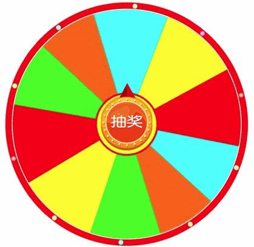

# 转盘抽奖逻辑
该库仅仅分离了转盘转动的逻辑，就是不处理UI.   

## 使用
演示效果：  
   
演示地址： https://xiangwenhu.github.io/circle-lottery/  
html
```html
<div class="draw-container">
    
       
</div>
<script src="./index.js"></script>
<script src="./lottery.js"></script>

```
js
```js
const PRIZE_COUNT = 9;
let enabledDraw = true;

const prizesEl = document.querySelector(".draw-prizes");

let lottery = new Lottery(prizesEl, {
  pits: PRIZE_COUNT
});

lottery.onEnded = function(ins, index, prizeIndexes) {
  enabledDraw = true;
};

document.querySelector(".draw-btn").addEventListener("click", function() {
  if (!enabledDraw) {
    return;
  }
  // 设置奖项
  const indexes = [1];
  lottery.setPrize(indexes);
  lottery.start();
});

```


## 特点
1. 代码少
2. 逻辑分离，修改简单
3. 接入简单
4. 内置贝塞尔timing function


## 思路：
1. css3的transition与transform
2. js的transitionend事件
3. 角度累加


## 待解决
1. 转盘本身有rotate角度
2. 转盘每个奖项占用角度不相同
